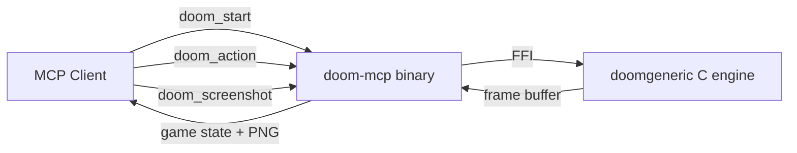

# DOOM via MCP

[](https://www.npmjs.com/package/doom-mcp)
[](https://www.npmjs.com/package/doom-mcp)
[](LICENSE)

**Can it run DOOM? Yes - your AI coding assistant can run DOOM.**

Play DOOM in Claude Code, Cursor, or any MCP-compatible client. The AI sees the game, fights demons, navigates levels, and reports what's happening - or you direct it move by move.

```
> Let's play DOOM!

  Starting E1M1 on medium difficulty...

  HP:100 Armor:0 | Pistol (key:2) | Ammo: 50b 0s 0r 0c | Kills:0 | E1M1
  No enemies in sight. Exploring the corridor ahead.

> Go forward and find some enemies

  Sprinting down the hallway... I can see an opening ahead.

  HP:100 Armor:0 | Pistol (key:2) | Ammo: 50b 0s 0r 0c | Kills:0 | E1M1
  ENEMIES IN SIGHT (aim for angle~0 then fire): Imp (HP:60) to your left (turn_left ~9) nearby

  There's an Imp to the left! Turning to face it...

> Shoot it!

  Aimed and firing!

  HP:100 Armor:0 | Pistol (key:2) | Ammo: 47b 0s 0r 0c | Kills:0 | E1M1
  ENEMIES IN SIGHT (aim for angle~0 then fire): Imp (HP:15) AHEAD close

  Hit! The Imp is wounded (HP:15). One more burst should finish it.

  HP:95 Armor:0 | Pistol (key:2) | Ammo: 44b 0s 0r 0c | Kills:1 | E1M1
  ITEMS: Stimpack (+10 HP) slightly to your right (turn_right ~4) point-blank (~3 ticks fwd+run to reach)
  1 kill! Want to see a screenshot?
```

---

## Table of Contents

- [How It Works](#how-it-works)
- [Quick Start](#quick-start)
- [Play Modes](#play-modes)
- [Tools Reference](#tools-reference)
- [Configuration](#configuration)
- [FAQ](#faq)
- [Architecture](#architecture)
- [Development](#development)
- [Credits](#credits)
- [License](#license)

---

## How It Works

A Rust MCP server embeds the real DOOM engine (doomgeneric) directly via FFI. No emulation, no child processes. Each tool call advances the game by a number of ticks and returns:

1. **Game state** - HP, armor, ammo, kills, position, current weapon
2. **Enemy intel** - visible enemies with human-readable direction, distance, and HP
3. **Nearby items** - health, ammo, armor, weapons within pickup range
4. **Doors and switches** - interactable linedefs detected within range
5. **Frame image** - small PNG thumbnail for the AI's vision

The AI uses this information to navigate, fight, and explore. You can direct it or let it play autonomously.



---

## Quick Start

### 1. Register with your MCP client

**Claude Code:**

```sh
claude mcp add doom --scope user -- npx -y doom-mcp
```

**Cursor, Windsurf, or any MCP client** - add to `.mcp.json`:

```json
{
  "mcpServers": {
    "doom": {
      "type": "stdio",
      "command": "npx",
      "args": ["-y", "doom-mcp"]
    }
  }
}
```

### 2. Play

Open a new session and say:

> "Let's play DOOM"

The AI will ask which mode you want, start the game on E1M1, and begin playing.

---

## Play Modes

| Mode | How it works | Best for |
|------|-------------|----------|
| **You direct** | You give commands ("go forward", "open that door", "shoot the imp"). The AI executes one action at a time and describes what happens. | Immersive guided play |
| **AI autonomous** | The AI makes all decisions - movement, combat, exploration. You watch and intervene if needed. | Watching the AI play |

---

## Tools Reference

### doom_start

Start or restart DOOM. Safe to call at any time — if a game is already running it restarts cleanly without needing a new session.

| Parameter | Type | Default | Description |
|-----------|------|---------|-------------|
| `skill` | int (1-5) | 3 | Difficulty: 1=baby, 2=easy, 3=medium, 4=hard, 5=nightmare |
| `episode` | int (1-4) | 1 | Episode number |
| `map` | int (1-9) | 1 | Map number |

### doom_action

Advance the game. All listed actions are held simultaneously for the tick duration.

| Parameter | Type | Required | Description |
|-----------|------|----------|-------------|
| `actions` | string | yes | Comma-separated: `forward`, `backward`, `turn_left`, `turn_right`, `strafe_left`, `strafe_right`, `fire`, `use`, `run`, `1`-`7` |
| `ticks` | int (1-105) | no | Game ticks to advance. Default 7. At 35 ticks/sec: 7 ~ 0.2s, 35 ~ 1s |

**Gameplay notes:**
- `fire` holds the trigger for the full duration. Pistol auto-fires every ~10 ticks.
- Turn and fire should be separate actions (turning while firing wastes ammo).
- `use` opens doors and activates switches.
- Weapon keys: 1=fists, 2=pistol, 3=shotgun, 4=chaingun, 5=rocket launcher, 6=plasma, 7=BFG.

### doom_screenshot

Save a full-resolution 320x200 screenshot to the system temp directory and open it in the default image viewer. Does not advance the game (beyond a brief pause for the frame to settle).

---

## Configuration

| Environment Variable | Description |
|---------------------|-------------|
| `DOOM_WAD_PATH` | Path to a custom IWAD file (e.g., your own `DOOM.WAD` or `DOOM2.WAD`) |
| `DOOM_MCP_DEBUG` | Set to `1` to enable debug logging to `doom-mcp.log` in the system temp directory |

The bundled Freedoom WAD works out of the box, but the original DOOM shareware WAD has better levels and sprites. To use it:

1. Download `DOOM1.WAD` from [doomworld.com/classicdoom/info/shareware.php](https://www.doomworld.com/classicdoom/info/shareware.php) (legal, free)
2. Set `DOOM_WAD_PATH` in your MCP config:

```json
{
  "mcpServers": {
    "doom": {
      "type": "stdio",
      "command": "npx",
      "args": ["-y", "doom-mcp"],
      "env": {
        "DOOM_WAD_PATH": "/path/to/DOOM1.WAD"
      }
    }
  }
}
```

If you own DOOM or DOOM 2, you can use those WADs the same way. To use any custom WAD:

```json
{
  "mcpServers": {
    "doom": {
      "type": "stdio",
      "command": "npx",
      "args": ["-y", "doom-mcp"],
      "env": {
        "DOOM_WAD_PATH": "/path/to/DOOM.WAD"
      }
    }
  }
}
```

---

## FAQ

**Does this work on Windows?**
Yes. The npm package includes a Windows x64 binary. Register it the same way as on macOS/Linux.

**Can I use my own DOOM WAD (DOOM.WAD, DOOM2.WAD)?**
Yes. Set `DOOM_WAD_PATH` in your MCP config. The shareware `DOOM1.WAD` is free to download from [doomworld.com](https://www.doomworld.com/classicdoom/info/shareware.php) and has much better levels than the bundled Freedoom. See the [Configuration](#configuration) section for details.

**How much does this cost in API tokens?**
Each `doom_action` call returns ~1-2KB of text (game state + enemy info) plus a ~6KB PNG thumbnail. That's roughly 1,500-2,500 tokens per action. A typical gameplay session of 50 actions uses about 75,000-125,000 tokens.

**Can the AI actually play DOOM well?**
It can navigate levels, find enemies, aim, and fight. It gets about 5-10 kills per session on E1M1 at medium difficulty. It struggles with enemies behind partial cover and navigating complex door sequences. It improves when you direct it.

**Can I play a specific level?**
Yes. Pass `episode` and `map` parameters to `doom_start`. For example, episode 1 map 3 would be `episode:1, map:3`.

**What happens when I die?**
The engine reports HP:0 and offers a screenshot of the death screen. Currently there's no restart within a session - start a new conversation to play again.

**Does this support multiplayer?**
Not yet. DOOM's multiplayer protocol could theoretically support multi-agent play, but it's not implemented.

**Is the AI cheating? Can it see through walls?**
No. Enemy detection uses DOOM's native line-of-sight check (`P_CheckSight`). The AI only sees enemies that would be visible on screen. Items are detected by proximity but the AI still has to walk over them to pick them up.

---

## Architecture

```
src/main.rs         MCP JSON-RPC server over stdio
src/doom.rs         Engine FFI wrapper: init, tick, frame capture, state extraction
src/renderer.rs     PNG rendering (216-color palette thumbnails for MCP, full RGB for screenshots)
src/paths.rs        WAD file discovery across platforms
src/log.rs          Debug logging to file
build.rs            Compiles doomgeneric C sources via cc crate (whitelist approach)
csrc/platform.c     DG_ callbacks, virtual time, key injection, enemy/item/door detection
```

The binary links the doomgeneric C engine at compile time. At runtime it is a single process with no subprocess spawning. Frames are read from a shared screen buffer and key inputs are injected through FFI.

**Virtual time** - The engine's clock is decoupled from wall time. Each `doomgeneric_Tick()` advances exactly one game tic (1/35th of a second), regardless of real elapsed time. This makes gameplay deterministic and prevents ticks from being skipped.

**Enemy and item detection** - The server iterates the engine's internal object list (`thinker_t` chain) to find nearby enemies and pickable items. Line-of-sight checks use Doom's native `P_CheckSight()`. Only visible enemies are reported to prevent "wallhack" cheating.

---

## Development

Requires: Rust toolchain, GCC, Make, Git, curl, unzip.

```sh
git clone https://github.com/gunnargrosch/doom-mcp.git
cd doom-mcp
bash scripts/setup.sh      # clones engines, downloads Freedoom WAD
cargo build --release       # compiles everything into a single binary
cargo test                  # runs unit + integration tests
```

Register the local build for testing:

```sh
claude mcp add doom --scope user -- ./target/release/doom-mcp
```

Enable debug logging:

```sh
claude mcp add doom --scope user -e DOOM_MCP_DEBUG=1 -- ./target/release/doom-mcp
tail -f /tmp/doom-mcp.log   # Linux/macOS (Windows: %TEMP%\doom-mcp.log)
```

### npm Package

Build the npm package locally:

```sh
bash scripts/build-npm.sh   # copies binary + WAD into npm/
cd npm && npm pack           # creates doom-mcp-0.1.2.tgz
```

Publish (requires npm account + `NPM_TOKEN` for CI):

```sh
cd npm && npm publish
```

---

## Credits

- [doomgeneric](https://github.com/ozkl/doomgeneric) by ozkl - portable DOOM engine
- [Freedoom](https://freedoom.github.io/) - open-source IWAD files
- [id Software](https://github.com/id-Software/DOOM) - the original DOOM (GPL-2.0)

---

## Changelog

See [CHANGELOG.md](CHANGELOG.md) for a detailed list of changes.

## License

MIT for the MCP server code in this repository.

doomgeneric is GPL-2.0 licensed and is cloned at build time (not vendored). The Freedoom WAD is distributed under a BSD-style license.
